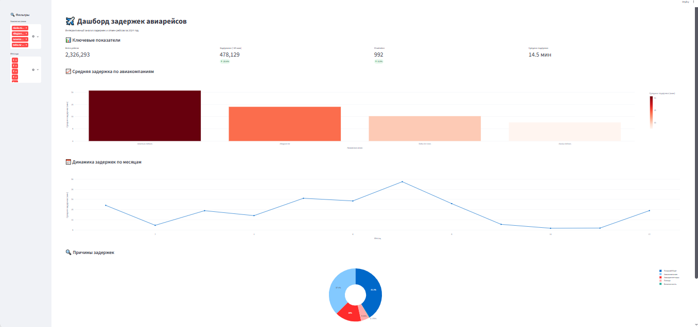

# ✈️ Дашборд задержек авиарейсов

Интерактивный дашборд для анализа задержек и отмен авиарейсов.
Построен на Streamlit и Plotly.

## 🎯 Что показывает дашборд

- **KPI-карточки**: всего рейсов, задержано, отменено, средняя задержка.
- **График 1**: средняя задержка по авиакомпаниям.
- **График 2**: динамика задержек по месяцам.
- **График 3**: причины задержек (погода, авиакомпания, поздний борт).
- **Фильтры**: по авиакомпаниям и месяцам.
- **Таблица** с исходными данными.

## 🛠️ Технологии

- Python 3.10+
- Streamlit — веб-интерфейс
- Plotly — интерактивные графики
- Pandas — обработка данных

## 📂 Источник данных

🔗 [Flight Delay Dataset — 2024 (Kaggle)](https://www.kaggle.com/datasets/hrishitpatil/flight-data-2024)

**Примечание:** CSV-файл не включён в репозиторий из-за размера.
Для запуска скачайте датасет по ссылке и положите файл `flight_data_2024.csv`
в папку с проектом.

Если файл большой (>300 МБ) и Pandas падает с
`ParserError: C error: out of memory` — используйте один из вариантов:

1. **Уменьшить типы данных** — в `load_data()` указаны `dtype` с `category` и `float32`.
2. **Читать чанками** и брать выборку:

    ```python
    chunks = []
    for chunk in pd.read_csv("flight_data_2024.csv", chunksize=500_000):
        chunks.append(chunk.iloc[::10])  # ~10% данных
    df = pd.concat(chunks, ignore_index=True)
    ```

3. **Сделать выборку один раз** скриптом `make_sample.py` — дашборд будет грузить уже маленький файл.

## 🚀 Как запустить

1. Установите зависимости:

    ```bash
    python -m pip install streamlit pandas plotly
    ```

2. Скачайте датасет и положите `flight_data_2024.csv` в папку проекта.

3. Запустите дашборд:

    ```bash
    python -m streamlit run app.py
    ```

4. Откройте в браузере `http://localhost:8501`.

## 📸 Скриншот



## 📁 Структура проекта

```
.
├── app.py                     # основной файл дашборда
├── flight_data_2024.csv       # данные (не включены в репозиторий)
├── dashboard.png              # скриншот дашборда
├── requirements.txt           # зависимости
└── README.md
```

## 📄 Лицензия

Этот проект распространяется под лицензией [MIT](LICENSE).
